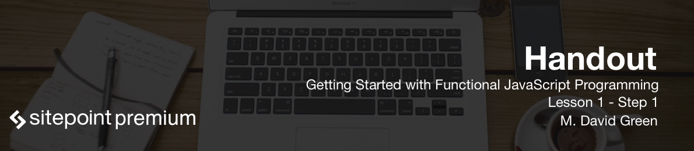

Hi, I'm M David Green and welcome you to this course on **functional JavaScript** from SitePoint. By the end of this course you're going to understand what functional JavaScript means and how to effectively apply it in the programming that you do.

There are a few things that you should know before you try to start this course.

* You should have a basic understanding of the fundamental syntax of JavaScript.
* You should understand how variables and types work in JavaScript. 
* You should know what the common operators are, what simple statements are and how they work, and how basic functions are created. 
* You should also understand ECMAScript 2015 syntax. These days, most common browsers and most development environments can support ECMAScript 2015, and future development is only gonna take us further in this direction. ECMAScript 2015 provides number of advantages, and it's worth applying right away.
* You need understand how to use comments in your JavaScript code, and what reserved words are and how to recognize them.
* You'll need to know statement syntax, how if statements work, how for statements are structured, how while statements work, and how switch statements work.
* You'll also need to know the basics of how functions work in JavaScript. This includes understanding what a function is, what arguments are, how scope works, what the this keyword represents and how to work with it, and how functions can be used as values. And finally, you'll need to understand ECMAScript 2015 syntax.

You can practice on the scripts that I'm going to be showing you anywhere in an HTML document, just by creating a file and using `script` tags. You can also practice in your browser's developer's tools.

If you have Node installed, you can run a Node environment and use it to execute any JavaScript command that you like. You can even create files and execute them with Node. Finally, you could practice in an online JavaScript sandbox, for example JSBin.

So if all this sounds good, let's get started talking about functional programming in JavaScript!

